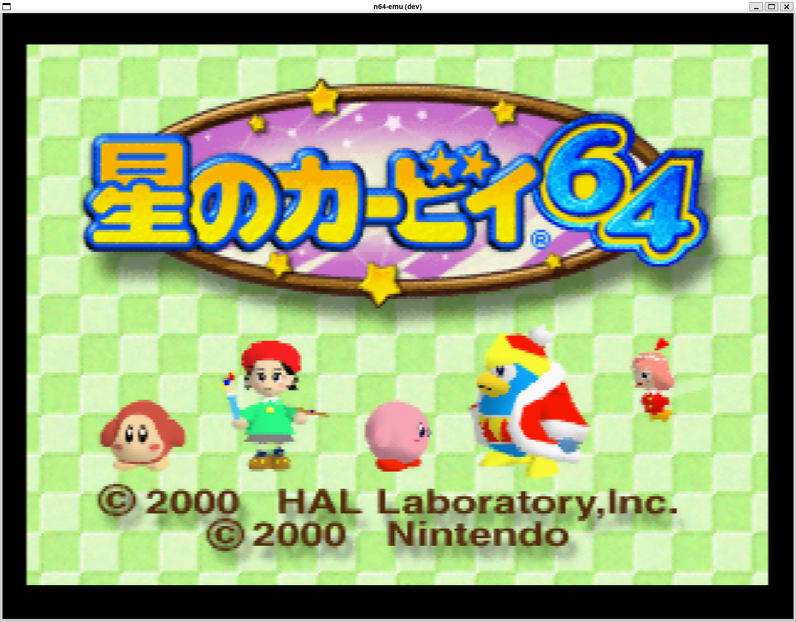

# Kamo64

Kamo64 is an experimental Nintendo 64 emulator with low-level emulation (LLE) and dynamic recompilation (JIT).



## Features

- Low-level emulation (LLE) of N64 hardware
- Full CPU JIT support (x86-64 only)
- RSP emulation with SIMD extensions
- Graphic rendering with GPU acceleration (Parallel-RDP)
- Internal resolution upscaling
- Frame interpolation
- Full audio support
- Full controller support
- Save data support

## Build

### Prerequisites

- Little-endian host (x86-64 / similar)
- C++20 compiler
- CMake 3.16 or later
- SDL2
- Vulkan

We support Windows, macOS, and Linux.

### Linux

```bash
sudo apt install cmake g++ libsdl2-dev libvulkan-dev glslc zenity

git clone --recursive git@github.com:kmc-jp/kamo64.git
cd kamo64
mkdir build
cd build
cmake -DCMAKE_BUILD_TYPE=Release ..
cmake --build . --parallel
```

`zenity` (or `kdialog`) is used for the GUI Open ROM dialog. Without it, open a ROM via the command line or Recents.

### Windows 

1. Install a Vulkan-capable GPU driver and the [Vulkan SDK](https://vulkan.lunarg.com/) (`glslc` is required to compile `src/app/shaders`).
2. Download SDL2 from https://github.com/libsdl-org/SDL/releases and extract it.
3. Set the `SDL2_DIR` environment variable to the location where you extracted the SDL2 development package.
4. Run the following commands:

```bash
git clone --recursive git@github.com:kmc-jp/kamo64.git
cd kamo64
mkdir build
cd build
cmake -DCMAKE_BUILD_TYPE=Release ..
cmake --build . --config Release --parallel
```

### macOS

1. Install [Homebrew](https://brew.sh/) if needed, then:

```bash
brew install cmake sdl2 molten-vk
```

2. Clone and build:

```bash
git clone --recursive git@github.com:kmc-jp/kamo64.git
cd kamo64
mkdir build
cd build
cmake -DCMAKE_BUILD_TYPE=Release ..
cmake --build . --parallel
```

If you already cloned without `--recursive`:

```bash
git submodule update --init --recursive
```

Notes:

- Vulkan is provided via [MoltenVK](https://github.com/KhronosGroup/MoltenVK) (Metal backend).
- CPU dynarec (`--jit`) is x86-64 only. On Apple Silicon, use `--no-jit` (cached interpreter).

## Run

```bash
./kamo64[.exe]
```

See `./kamo64 --help` for available options.

## Test

You can run the test suite with CTest:

```bash
# In build directory
ctest -C Debug
```

## Contributing

We do not currently accept pull requests that add new features.
Bug reports/fixes and new tests are very welcome 😀.
See [CONTRIBUTING.md](CONTRIBUTING.md).

## Related Projects

This project was heavily inspired by the following projects ❤️.

- [Project64](https://github.com/project64/project64): N64 Emulator
- [Simple64](https://github.com/simple64/simple64): Accurate N64 Emulator
- [n64](https://github.com/Dillonb/n64): experimental low-level n64 emulator
- [Kaizen](https://github.com/SimoneN64/Kaizen): Experimental Nintendo 64 emulator

## Acknowledgements

- [n64-tests](https://github.com/Dillonb/n64-tests) by [Dillon](https://github.com/Dillonb): CPU test ROMs
- [parallel-RDP](https://github.com/Themaister/parallel-rdp) by [Themaister](https://github.com/Themaister): Vulkan RDP implementation

## License

See [LICENSE](LICENSE).

"Nintendo 64" is a registered trademark of Nintendo Co., Ltd.
